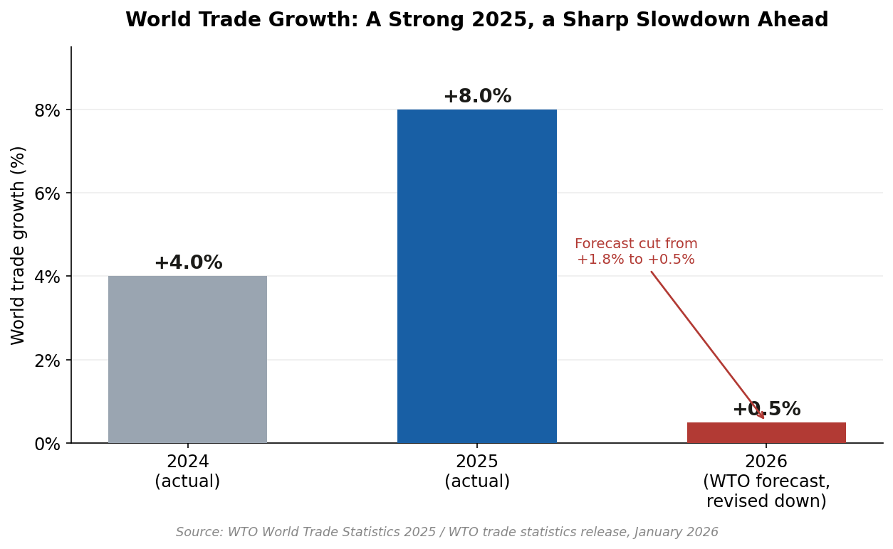
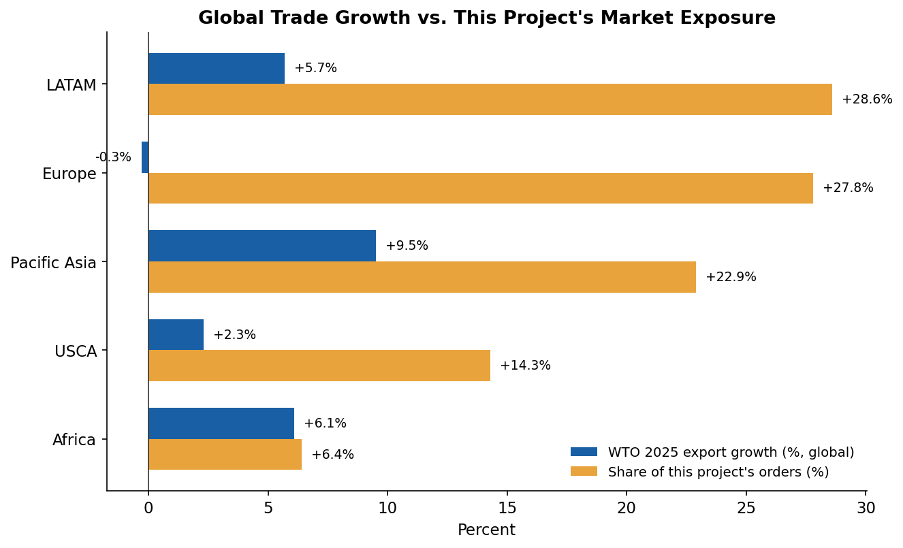

# Global Trade Introduction

## What's Happening in the World Right Now

Global trade just had a stronger year than expected — but the strength is
uneven, front-loaded, and shifting fast by region.

World trade in goods and commercial services rose 8% in 2025, reaching
$34.89 trillion, up from just 4% growth the year before. World
merchandise exports alone grew 7.2%, to $26.3 trillion — $1.8 trillion
more than 2024 (WTO, World Trade Statistics 2025).

But that growth wasn't steady, and it isn't expected to hold. The first
half of 2025 outperformed expectations, driven by heavy AI-related
spending, a rush of North American imports ahead of anticipated tariff
hikes, and strong trade elsewhere. By the third quarter, growth had
flattened out even as the dollar value of trade hit an all-time record —
a sign of rising prices more than rising real activity. The WTO has since
cut its 2026 growth forecast from 1.8% down to just 0.5%. Meanwhile,
import measures introduced during 2025's trade tensions now cover roughly
$2.24 trillion — about 9% of total world merchandise imports (WTO).

In short: global trade in 2025 was volatile, tariff-exposed, and
region-dependent in a way it hasn't been in years. Diesel and freight
costs are swinging with shipping surges timed around policy deadlines.
Import costs are moving unevenly as tariffs reshape who pays what, and
where. Inflation is reshaping how much consumers are actually willing to
buy, and that pressure isn't hitting every region the same way.

## Why This Project

Most supply chain tools treat "macro risk" as background noise — a line
item to note, not something the system actually reacts to. That gap is
what this project is built to close: a working model of how three real,
current macroeconomic shocks — diesel prices, import price inflation, and
consumer inflation — actually flow through a real supply chain and change
concrete operational decisions, not just risk scores.

This isn't a response to a hypothetical scenario. It's a model of a
dynamic that's actively playing out in global trade data right now, built
on a real 180,000-order e-commerce dataset, so the question isn't
academic: *if a shock like this hit today, what should this business
actually do differently?*

## Where This Project's Own Data Sits Inside That Picture

The paragraphs above describe the world. The table and chart below answer
a narrower question: **where does this specific project's own order data
actually sit inside that picture?**

The dataset's 180,519 orders roll up into five markets:

| Market | Share of this project's orders | WTO 2025 export growth (region) |
|---|---:|---:|
| LATAM | 28.6% | +5.7% (S. & Central America) |
| Europe | 27.8% | &minus;0.3% (Europe) |
| Pacific Asia | 22.9% | +9.5% (Asia — fastest-growing) |
| USCA | 14.3% | +2.3% (North America) |
| Africa | 6.4% | +6.1% (Africa) |

*(WTO growth figures: export volume growth, first nine months of 2025,
year-on-year, WTO Jan 2026 release. Order share: this project's own data,
`data/DataCoSupplyChainDataset_clean.csv`.)*

Three things worth pulling from this pairing:

1. **Europe is a risk concentration.** It's this project's 2nd-largest
   market exposure (27.8%) but the *only* region with negative export
   growth globally right now.
2. **Africa is an under-tapped opportunity.** It's the 2nd-fastest
   growing region globally (+6.1%) but by far the smallest exposure here
   (6.4%).
3. **LATAM is genuinely well-positioned** — both the project's largest
   exposure (28.6%) *and* solid positive growth (+5.7%), not just a large
   market by coincidence.

---

*Sources: WTO World Trade Statistics 2025 and WTO trade statistics
release (January 2026); this project's `market` field,
`data/DataCoSupplyChainDataset_clean.csv` (180,519 orders).*
